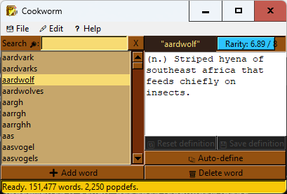

# Cookworm: The BookWorm Deluxe wordlist and popdefs editor

This program edits the wordlist and popup definitions for the game [BookWorm Deluxe by PopCap Games](https://oldgamesdownload.com/bookworm-deluxe/) released in 2006. I created this program after augmenting the wordlist more manually using [this free list of English words by dwyl](https://github.com/dwyl/english-words), but then discovering that it contained some errors, along with real words that I felt deserved a popdef. 

## Dependencies:
This program relies on Python >= 3.10 (formally written in Python 3.14), plus the following non-native Python libraries, which can be installed using Pip:
- [NLTK](https://pypi.org/project/nltk/)
- [wordfreq](https://pypi.org/project/wordfreq/)
- [PyYAML](https://pypi.org/project/pyyaml/)

You can find executables with bundled Python and the dependencies in the Releases page of this repository.

## Usage:
To run from source, install Python 3.10 or newer, and then the dependencies, then use Python to run the .pyw program.

For the auto-define button to work, the program requires an internet connection to download the NLTK wordnet package when it starts up for the first time. If it doesn't have one, it will still function mostly-normally, but the button will just show an error message. It will try to download wordnet again on the next startup.

### Program operation:
When the program opens, it will default to opening the BookWorm Deluxe folder in the expected system location per your platform, or the last location that it was successfully opened to, whichever seems better. The memory for that last opened location is stored in `~/.cookworm/config.yaml`. You can safely delete this file to reset the configuration to the defaults. If on Linux or MacOS, it will assume the default Wine prefix in your user directory. If it does not find the wordlist.txt and popdefs.txt files in this default location, or the default location doesn't exist, it will ask you to choose the BookWorm Deluxe folder manually.

Once the program loads the files, you should see a list of words in the left pane. The bottom of the window shows the current number of words and popdefs in memory when idle, and status information on any currently running threaded operations.
- Select a word to see its usage rarity according to wordfreq (8.00 / 8 for no wordfreq entry), and its current popdef (blank for no popdef). If TKinter is running natively (so, not on Windows), it has color changing function as well: If the usage frequency is below an arbitrary value where I think it might need a popdef, the meter will be sapphire blue. Otherwise, it will be paper brown. While a word is selected you can:
    - Edit the popdef and save it. Note that if you select a different word before saving the definition, it will reset.
    - Reset the popdef to what it was the last time you saved it.
    - Auto-create a popdef using the NLTK wordnet English dictionary.
    - Delete the word from the wordlist.
- You can search for a word with the search box, using the X button to clear the search query.
- You can add a new word to the wordlist with the Add word button. Once added, it will become selected.
- The File menu provides the following operations:
    - Open (Ctrl + O): Open a different word list and popdefs file pair.
    - Reload (Ctrl + R): Reload the current word list and popdefs file pair, reversing all your changes.
    - Save (Ctrl + S): Save your changes. Automatically asks if you would like to do a backup if the original files are older than my program.
    - Backup existing (Ctrl + B): Copy the existing files to a backup named version in the same directory.
- The Edit menu provides the following operations:
    - Add several words: Select a text file of new words and add them all.
    - Auto-define undefined rare words: Find all words below my arbitrary usage threshold and attempt to auto-define them.
    - Delete several words: Select a text file of words and delete them all.
    - Delete words of invalid length: Removes words that BookWorm Deluxe will not allow as moves because of their length.
    - Delete duplicate word listings: Make sure that none of the entries in the word list are redundant.
    - Delete orphaned definitions: Removes definitions from the popdefs that do not have a word in the wordlist.
    - Delete unencodable definitions: Removes definitions that cannot be encoded to ISO 8859-15 (what the original files use).

## Information on antivirus false positives for PyInstaller executables:

Recently, I discovered that multiple antivirus services are consistently flagging any and all Windows executables packaged with PyInstaller. This is a false positive: While malware could certainly be written in Python and subsequently packaged with PyInstaller into an exe, the exe would be malicious because of the packaged Python code, not because of PyInstaller. I've reported the problem to the antivirus services that I found false positive reporting forms for, but often only the specific app version was whitelisted, if anything at all. It turns out that this is a known issue with, or rather limitation of, PyInstaller, and therefore there isn't anything its devs can permanently do about it. Long story short, a PyInstaller executable works by extracting from itself the Python interpreter, supporting libraries, and the script to run. What's more, it's doing this all in temporary storage. That looks rather suspicious to some antimalware heuristics, and understandably so. Since then, Malwarebytes in particular has tried to remedy the issue on their end, assumably by whitelisting the PyInstaller bootloader hash, but a new bootloader update for PyInstaller could change that. I'd like to thank Malwarebytes for their effort, in any case. They in particular were very quick to fix the false positive for my apps individually, even before the PyInstaller master fix. I don't use them personally, but that is good service.

## Bundling yourself:
If you wish to bundle the application yourself with PyInstaller, you can run `pyinstaller_build.sh` in Windows Git Bash or Linux (or possibly MacOS). It requires that:
- You have an internet connection.
- The `python` and `pip` command point to Python 3.10 or newer and it's respective Pip tool (may point to Python 2.7 on some systems).
- The venv package for that Python is installed.
It will automatically set up a clean virtual environment with the program's dependencies and PyInstaller, update the word frequency list, then package the application. Be warned of [issue #18](https://github.com/thelabcat/bookworm-wordlist-editor/issues/18), though.

Hope this helps!

## Legal:
Copyright 2025 Wilbur Jaywright d.b.a. Marswide BGL.

Licensed under the Apache License, Version 2.0 (the "License");
you may not use this file except in compliance with the License.
You may obtain a copy of the License at

    http://www.apache.org/licenses/LICENSE-2.0

Unless required by applicable law or agreed to in writing, software
distributed under the License is distributed on an "AS IS" BASIS,
WITHOUT WARRANTIES OR CONDITIONS OF ANY KIND, either express or implied.
See the License for the specific language governing permissions and
limitations under the License.

**S.D.G.**
